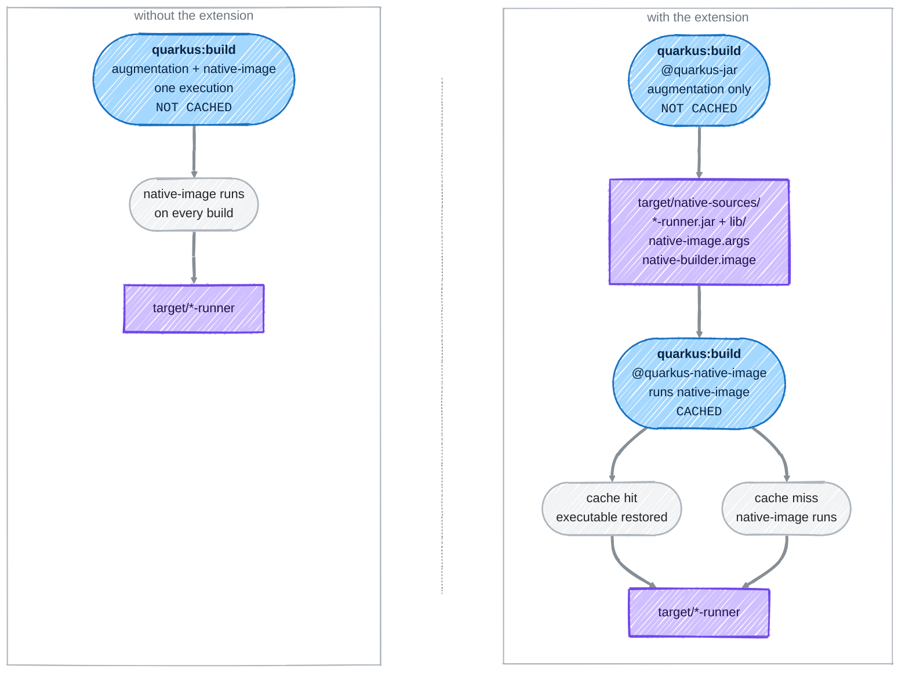

> _This repository is maintained by the Develocity Solutions team, as one of several publicly available repositories:_
> - _[Android Cache Fix Gradle Plugin][android-cache-fix-plugin]_
> - _[Common Custom User Data Gradle Plugin][ccud-gradle-plugin]_
> - _[Common Custom User Data Maven Extension][ccud-maven-extension]_
> - _[Common Custom User Data sbt Plugin][ccud-sbt-plugin]_
> - _[Develocity Build Configuration Samples][develocity-build-config-samples]_
> - _[Develocity Build Validation Scripts][develocity-build-validation-scripts]_
> - _[Develocity Open Source Projects][develocity-oss-projects]_
> - _[Quarkus Build Caching Extension][quarkus-build-caching-extension]  (this repository)_
# Quarkus Build Caching Extension

Makes the expensive half of a Quarkus native build — the `native-image` run — cacheable with [Develocity](https://docs.develocity.ai/maven/current/maven-extension/#using_the_build_cache), by keying it on the jar the augmentation produces.

A change that does not reach the runner jar — a `provided` dependency, a build-time-only library — stops costing a native image build.

## What it does

A native build does two very different things in one goal: it augments the application into a jar, then hands that jar to `native-image`. The first takes seconds, the second minutes. As one goal execution, the expensive half is keyed on the inputs of the cheap one, the compile classpath included.

Declaring the `build` goal twice separates them, and the extension caches the second:



The first execution is cheap and always runs. The second is the one that costs minutes, and it is keyed only on what the first wrote — not on the compile classpath — so a change that does not reach the runner jar reuses the executable.

## Requirements

- **Quarkus 3.39.3 or above.** Below it the augmentation output is not stable enough for the cache to ever hit — see [scope and requirements](doc/scope.md).
- `com.gradle:develocity-maven-extension`
- An in-container native build by default, which pins the toolchain and makes entries shareable between machines. The requirement can be lifted when every environment sharing the cache has identical system inputs — see [lifting the in-container requirement](doc/configuration.md#lifting-the-in-container-requirement).

## Setup

Two steps. Declare the extension in `.mvn/extensions.xml`:

```xml
<extensions>
    <extension>
        <groupId>com.gradle</groupId>
        <artifactId>develocity-maven-extension</artifactId>
        <version>2.5.0</version>
    </extension>
    <extension>
        <groupId>com.gradle</groupId>
        <artifactId>quarkus-build-caching-extension</artifactId>
        <version>2.0</version>
    </extension>
</extensions>
```

Then declare the `build` goal twice, the first one stopping at the augmentation:

```xml
<plugin>
    <groupId>${quarkus.platform.group-id}</groupId>
    <artifactId>quarkus-maven-plugin</artifactId>
    <version>${quarkus.platform.version}</version>
    <extensions>true</extensions>
    <executions>
        <execution>
            <id>quarkus-jar</id>
            <phase>package</phase>
            <goals><goal>build</goal></goals>
            <configuration>
                <systemProperties>
                    <quarkus.native.sources-only>true</quarkus.native.sources-only>
                </systemProperties>
            </configuration>
        </execution>
        <execution>
            <id>quarkus-native-image</id>
            <phase>package</phase>
            <goals><goal>build</goal></goals>
        </execution>
    </executions>
</plugin>
```

That is all. The extension recognizes the layout on its own and sets up the rest: Quarkus config tracking, the artifact descriptor after a cache hit, and the test goal inputs. See [what it sets up for you](doc/how-it-works.md#what-the-extension-sets-up-for-you).

## A version that moves every build

A common one. A project version carrying a commit id gives every commit a different cache key, so `native-image` runs every time even when nothing the application is built from has changed. Two properties:

```xml
<properties>
    <develocity.quarkus.version.independent.build>true</develocity.quarkus.version.independent.build>
    <quarkus.application.version>stable</quarkus.application.version>
</properties>
```

The first keeps the version out of the name the jar is built under and out of the jar's `META-INF/maven/**`, then links the executable back to the name the rest of the build expects. The second you have to set yourself: it defaults to the project version and is compiled into the application, so the extension cannot normalize it away — it only warns.

See [a version that moves every build](doc/dynamic-version.md) for what moves, and for the knock-on effect on `quarkus.container-image.tag`.

## What to expect

All six applications of the [Quarkus super-heroes workshop](https://quarkus.io/quarkus-workshops/super-heroes/), built natively:

| | one `build` execution | split |
|---|---|---|
| whole repository, cold cache | 507s | 459s |
| whole repository, nothing changed | 507s | **52s** |

Splitting costs nothing on a cold cache — the second augmentation adds about 2s to an 80s build — and a cache hit skips `native-image` entirely. Per application that is 70–100s down to 8s.

### Cache hits and misses

The key is the runner jar, the `native-image` arguments, the builder image and the Quarkus configuration the augmentation recorded. Anything that does not reach those reuses the executable:

| | |
|---|---|
| An application whose sources and dependencies have not changed | **hit** — not every file in a repository is source code: documentation, CI configuration, scripts and the like reach nothing the native image is built from |
| A `provided` or `test` dependency added or upgraded | **hit** — it changes the compile classpath, not the runtime closure the native image is built from |
| A test-only change | **hit** — test classes are in neither the runner jar nor `lib/` |
| The same commit built on another machine, or in another pipeline | **hit** — the in-container builder image pins the toolchain, so entries are shared |
| A change to application code, or to a runtime dependency | **miss** — it reaches the runner jar |
| A Quarkus build-time configuration change | **miss** — the augmentation records it, and it is part of the key |

It pays most on CI, where the main branch populates a remote cache that pull requests and developer machines read from. See the [benchmark](doc/benchmark.md) for the per-application numbers and where to apply it.

## Things to weigh

> [!WARNING]
> **A native executable is a very large cache entry.** Copying one in and out of the local cache, and transferring it to and from a remote cache, is itself work — it has to be balanced against the duration of the `native-image` run it avoids, and against the storage the cache node has to carry.

> [!WARNING]
> **Do not expect a high hit rate.** Most code changes reach the runner jar and so change the cache key. A hit is still worth having: it skips the `native-image` run entirely, while the split adds only a short second augmentation when it misses. That asymmetry is what makes a low hit rate pay — but only as long as the entries earning those hits are worth the space they occupy.

## Going further

| | |
|---|---|
| [Scope and requirements](doc/scope.md) | what is cached, what is not, and the in-container strategy |
| [How it works](doc/how-it-works.md) | the two goals, the cache key, what a split build changes |
| [Configuration](doc/configuration.md) | every switch |
| [Benchmark](doc/benchmark.md) | the numbers above, and how they were measured |
| [A version that moves every build](doc/dynamic-version.md) | a commit id in the project version defeats the cache, and what to do |
| [Troubleshooting](doc/troubleshooting.md) | what the log lines mean |

[android-cache-fix-plugin]: https://github.com/gradle/android-cache-fix-gradle-plugin
[ccud-gradle-plugin]: https://github.com/gradle/common-custom-user-data-gradle-plugin
[ccud-maven-extension]: https://github.com/gradle/common-custom-user-data-maven-extension
[ccud-sbt-plugin]: https://github.com/gradle/common-custom-user-data-sbt-plugin
[develocity-build-config-samples]: https://github.com/gradle/develocity-build-config-samples
[develocity-build-validation-scripts]: https://github.com/gradle/develocity-build-validation-scripts
[develocity-oss-projects]: https://github.com/gradle/develocity-oss-projects
[quarkus-build-caching-extension]: https://github.com/gradle/quarkus-build-caching-extension
[develocity]: https://develocity.ai
[apache-license]: https://www.apache.org/licenses/LICENSE-2.0.html
