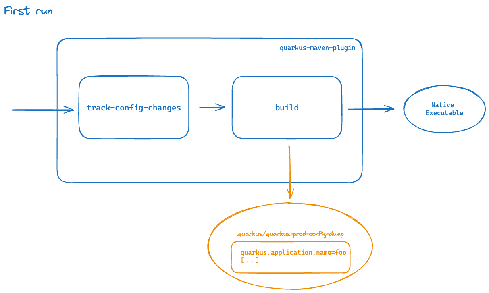
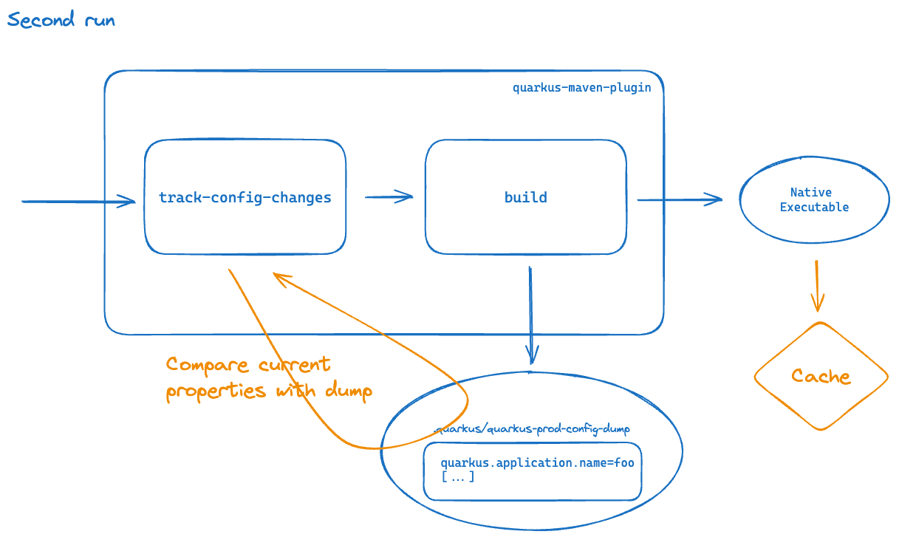
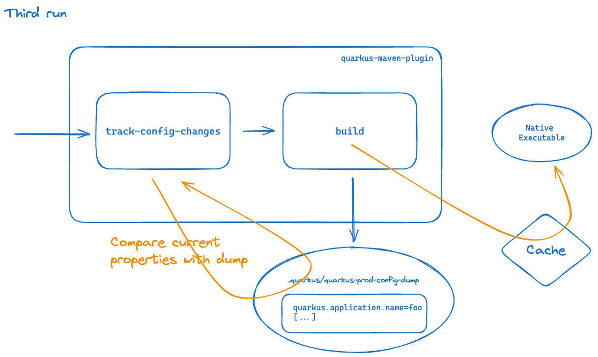

> _This repository is maintained by the Develocity Solutions team, as one of several publicly available repositories:_
> - _[Android Cache Fix Gradle Plugin][android-cache-fix-plugin]_
> - _[Common Custom User Data Gradle Plugin][ccud-gradle-plugin]_
> - _[Common Custom User Data Maven Extension][ccud-maven-extension]_
> - _[Common Custom User Data sbt Plugin][ccud-sbt-plugin]_
> - _[Develocity Build Configuration Samples][develocity-build-config-samples]_
> - _[Develocity Build Validation Scripts][develocity-build-validation-scripts]_
> - _[Develocity Open Source Projects][develocity-oss-projects]_
> - _[Quarkus Build Caching Extension][quarkus-build-caching-extension]  (this repository)_

# Custom Maven Extension to make Quarkus build goal cacheable
This Maven extension allows to make the [Quarkus Maven plugin](https://quarkus.io/guides/quarkus-maven-plugin) `build` goal cacheable.

This project performs programmatic configuration of the [Develocity Build Cache](https://docs.develocity.ai/maven/current/maven-extension/#using_the_build_cache) through a Maven extension. See [here](https://docs.develocity.ai/maven/current/maven-extension/#custom_extension) for more details.

*Note:*<br>
A native executable can be a very large file. Copying it from/to the local cache, or transferring it from/to the remote cache can be an expensive operation that has to be balanced with the duration of the work being avoided.

## Requirements
Quarkus 3.2.4 and above which brings [track-config-changes goal](https://quarkus.io/guides/config-reference#tracking-build-time-configuration-changes-between-builds)

> [!NOTE]  
> Although Quarkus 3.2.4 is required, 3.9.0 and above is recommended as it exposes [Quarkus extra dependencies](#quarkus-extra-dependencies) which is added as extra input by the current extension.
> 
> This additional input is necessary when using snapshot versions (or when overwriting fixed version) of
> - The Quarkus dependencies
> - A custom Quarkus extension

## Limitations

### Supported package types
Only the `native`, `uber-jar`, `jar`, `fast-jar` and `legacy-jar` [packaging types](https://quarkus.io/guides/maven-tooling#quarkus-package-pkg-package-config_quarkus.package.type) can be made cacheable

### Build strategy
By default, the `native` packaging is cacheable only if the in-container build strategy (`quarkus.native.container-build=true`) is configured along with a fixed build image (`quarkus.native.builder-image`).
The in-container build strategy means the build is as reproducible as possible. Even so, some timestamps and instruction ordering may be different even when built on the same system in the same environment.

If the build environments are strictly identical, this restriction can be removed by setting `DEVELOCITY_QUARKUS_NATIVE_BUILD_IN_CONTAINER_REQUIRED=false`. See [configuration section](#build-strategy-1) for more details.

### Cache key width for native builds
With a single `build` execution, the native executable is keyed on everything feeding the Quarkus augmentation, the compile classpath in particular. Any classpath change therefore triggers a full native image generation, even when it does not change the jar the native image is built from.

A [split native build](#split-native-build) narrows that key down to the jar itself.

> [!NOTE]
> When the in-container build strategy is used as a fallback the caching feature will be disabled. The fallback may happen due to GraalVM requirements not met. The recommendation is to explicitly set the in-container strategy (`quarkus.native.container-build=true`) to benefit from caching

## Usage

### Extension declaration

Reference the extension in `.mvn/extensions.xml` (this extension requires the develocity-maven-extension):

```xml
<extensions>
    <extension>
        <groupId>com.gradle</groupId>
        <artifactId>develocity-maven-extension</artifactId>
        <version>2.5.0</version>
    </extension>
    <extension>
        <groupId>com.gradle</groupId>
        <artifactId>quarkus-build-caching-extension</artifactId>
        <version>1.12</version>
    </extension>
</extensions>
```

Note on the Compatibility with The Develocity extension:

| Extension                                      | Compatible version |
|------------------------------------------------|--------------------|
| `com.gradle:develocity-maven-extension`        | 1.+                |
| `com.gradle:gradle-enterprise-maven-extension` | 0.12               |

### The `quarkus-maven-plugin` configuration

Enable [Quarkus config tracking](https://quarkus.io/guides/config-reference#dumping-build-time-configuration-options-read-during-the-build) in `pom.xml`:

```xml
<properties>
    <quarkus.config-tracking.enabled>true</quarkus.config-tracking.enabled>
</properties>
```

Add the `track-prod-config-changes` execution to the `quarkus-maven-plugin` configuration:

```xml
<plugin>
    <groupId>${quarkus.platform.group-id}</groupId>
    <artifactId>quarkus-maven-plugin</artifactId>
    <version>${quarkus.platform.version}</version>
    <extensions>true</extensions>
    <executions>
        <execution>
            <id>track-prod-config-changes</id>
            <phase>process-resources</phase>
            <goals>
                <goal>track-config-changes</goal>
            </goals>
            <configuration>
                <dumpCurrentWhenRecordedUnavailable>true</dumpCurrentWhenRecordedUnavailable>
            </configuration>
        </execution>
        <execution>
            <goals>
                <goal>build</goal>
                <goal>generate-code</goal>
                <goal>generate-code-tests</goal>
            </goals>
        </execution>
    </executions>
</plugin>
```

### Quarkus configuration dump initialization

After applying the quarkus-maven-plugin [configuration step](#quarkus-maven-plugin-configuration), invoke the Quarkus `build` goal to generate the `.quarkus/quarkus-prod-config-dump` file.
This file is required to make the Quarkus `build` goal cacheable.

The file should be checked-in to the source code repository.
in continuous integration environment, an alternative is to have the file restored (see [this option](https://github.com/marketplace/actions/cache#restoring-and-saving-cache-using-a-single-action) for GitHub actions as an example).

If the file has some system dependent properties, it is possible to have [different configuration dump](#quarkus-configuration-dump) to reflect those changes (local, ci, os...) conditionally enabled by Maven profiles. 

It is also possible to [ignore properties](#ignore-properties-in-quarkus-configuration-dump) not impacting the produced artifacts. 
The `quarkus.native.graalvm-home` and `quarkus.native.java-home` are some classic examples, the JDK version is already captured as a goal input and the path to the JDK does not impact the produced artifact.

## Split native build

A native build does two very different things in one `build` execution: it augments the application into a jar, then hands that jar to `native-image`. The first part takes seconds, the second one minutes. Because both happen in the same goal execution, the expensive part is keyed on the inputs of the cheap one, the compile classpath in particular.

Quarkus can stop right after the augmentation with [`quarkus.native.sources-only`](https://quarkus.io/guides/native-reference#build-native-image-separately), leaving in `target/native-sources` the runner jar, its dependencies, the `native-image` arguments and, for an in-container build, the builder image to use. Declaring the `build` goal twice therefore splits a native build in two:

```xml
<plugin>
    <groupId>${quarkus.platform.group-id}</groupId>
    <artifactId>quarkus-maven-plugin</artifactId>
    <version>${quarkus.platform.version}</version>
    <extensions>true</extensions>
    <executions>
        <execution>
            <id>track-prod-config-changes</id>
            <phase>process-resources</phase>
            <goals>
                <goal>track-config-changes</goal>
            </goals>
            <configuration>
                <dumpCurrentWhenRecordedUnavailable>true</dumpCurrentWhenRecordedUnavailable>
            </configuration>
        </execution>
        <!-- Step 1: augmentation only, produces target/native-sources -->
        <execution>
            <id>quarkus-jar</id>
            <phase>package</phase>
            <goals>
                <goal>build</goal>
            </goals>
            <configuration>
                <systemProperties>
                    <quarkus.native.sources-only>true</quarkus.native.sources-only>
                </systemProperties>
            </configuration>
        </execution>
        <!-- Step 2: native image generation, cached -->
        <execution>
            <id>quarkus-native-image</id>
            <phase>package</phase>
            <goals>
                <goal>build</goal>
            </goals>
        </execution>
    </executions>
</plugin>
```

The extension recognizes this layout on its own: no configuration flag turns it on. It applies as soon as a project declares several `build` executions of which exactly one requests `native-sources` through the mojo's `systemProperties`. Any other layout keeps the single-execution behavior described above.

The execution ids are free, the extension does not match on them.

### What this buys

The second execution does not consume the first one's jar, it re-runs the augmentation itself. What it inherits is a *cache key*: the jar and the `native-image` arguments the first execution just produced. Since the [Quarkus reproducibility work](https://github.com/quarkusio/quarkus/pull/54895) makes the augmentation output stable, two builds whose classpath differs but whose augmentation output does not now share the native image.

Measured on a `quarkus-rest` application, in-container build, adding a `provided` dependency (on the compile classpath, absent from the runtime closure the native image is built from):

| | single `build` execution | split native build |
|---|---|---|
| First build | 59s | 51s |
| Nothing changed | 4s | 6s |
| Compile classpath changed | 56s (`native-image` re-runs) | 6s (`native-image` reused) |

Splitting costs nothing measurable: the duplicated augmentation is ~1.3s of a ~50s build, and `native-image` runs as a subprocess either way.

### The configuration dump is still required, but no longer has to be checked in

[Config tracking](#the-quarkus-maven-plugin-configuration) must be enabled: the native image generation keys on the configuration dump, and refuses to be cached without one.

Not every Quarkus property reaches `native-image.args`. The build steps running *after* `native-image` are the reason: `quarkus.native.compression.*` drives the UPX compression of the produced executable, is recorded in the dump, and appears in neither the jar nor the arguments. Keying on the jar and the arguments alone would hand back an executable compressed with the wrong settings.

What changes is *which* dump is used. A single execution has to compare the dump recorded by the **previous** build against the current values, because Quarkus properties are only discovered during the augmentation, which is why that setup needs the dump [checked in or restored](#quarkus-configuration-dump-initialization). In a split build the augmentation runs first, every time, so by the time the second execution's key is computed the dump on disk describes **this** build. Nothing is compared against a previous build, and nothing has to be checked in.

The extension verifies that: the dump has to record `quarkus.native.sources-only=true`, which only an augmentation-only execution writes. A dump left over from an earlier build, or checked in from a single-execution setup, is rejected and the native image generation is not cached.

Recording only the augmentation loses nothing. Config tracking resolves the whole Quarkus configuration rather than only the properties the executed build steps happen to read, so an augmentation-only build records the same 167 properties as a full native build of the same project, with `quarkus.native.sources-only` as the single differing value. Native-specific properties are all there, output type included: `quarkus.package.jar.type`, `quarkus.native.debug.enabled` and `quarkus.native.compression.level` are recorded with the value they were given, whether or not the build step reading them runs. The config half of the second execution's key is therefore exactly as strong as a single execution's config tracking.

Two details of how the dump is keyed on:
- properties are added as individual goal inputs rather than as a file, so a cache miss names the property responsible
- `quarkus.native.graalvm-home`, `quarkus.native.java-home` and `quarkus.native.sources-only` are [ignored](#ignore-properties-in-quarkus-configuration-dump). The first two hold absolute paths, and the third differs by design between the two executions

### The augmentation is never cached

Only the native image generation is cached. The augmentation is inexpensive, a couple of seconds against the minutes `native-image` takes, while `target/native-sources` holds every runtime dependency and would make a far larger cache entry than the native executable itself.

Always executing it also has two consequences the second execution relies on: `target/quarkus-artifact.properties` stays present, which a cache hit on the augmentation would not achieve since the native image generation cannot declare that file as an output either (see [Limitations](#limitations-1)), and the configuration dump is rewritten on every build.

### Limitations

- **`target/quarkus-artifact.properties` is not restored by the native image generation.** Quarkus writes this descriptor at the end of every augmentation, so both executions produce it. Declaring a file that an earlier goal execution also writes is an [overlapping output](https://docs.develocity.ai/maven/current/maven-extension/), which Develocity resolves by refusing to store the later execution, defeating the split. The descriptor is consequently left describing the native-sources jar (`type=native-sources`) after a cache hit, so `@QuarkusIntegrationTest` against the native executable is not supported with a split build. Projects running native integration tests should keep a single `build` execution. Lifting this needs Quarkus to skip writing the descriptor in `sources-only` mode.
- **`quarkus.package.output-directory` cannot be used to work around it.** Relocating the augmentation output fails in `sources-only` mode (`NoSuchFileException` on the `lib` directory), reported against Quarkus 3.39.3.
- **The same applies to any other file both executions write**, [extra outputs](#extra-outputs) included: they cannot be declared on the native image generation. Since the augmentation always runs, they are produced on every build, just with the configuration of an augmentation-only build.
- **The local GraalVM version is not part of the key** for a non in-container build. `native-sources/graalvm.version` holds the version Quarkus *supports*, a hardcoded constant, not the installed one. The in-container build strategy, required by default, pins the whole toolchain through `native-sources/native-builder.image`.
- Absolute paths appearing in `native-image.args`, which `quarkus.native.agent-configuration-directory` and PGO profiles introduce, make the key machine-specific.
- **Run the two executions together.** The native image generation is keyed on whatever `target/native-sources` holds, so invoking it alone (`mvn quarkus:build@quarkus-native-image` without the augmentation, on a dirty `target`) keys it on a previous build's jar and can restore a stale executable. Always let the `package` phase run both.
- **`-Dquarkus.native.sources-only=true` on the command line applies to both executions**, which leaves the build without a native executable. The property belongs in the first execution's `systemProperties`, nowhere else.
- **Parallel builds.** The `build` goal applies its `systemProperties` to the JVM running Maven, so `-T` carries the race [the goal already warns about](https://github.com/quarkusio/quarkus/blob/main/devtools/maven/src/main/java/io/quarkus/maven/BuildMojo.java) across modules of a multi-module build.

## Configuration

Configuration can be set with (listed in order of precedence ):
- [Environment variables](#environment-variables)
- [Maven properties](#maven-properties)
- [Configuration file](#configuration-file)

### Environment variables

#### Feature toggle

The caching can be disabled by setting:
```properties
DEVELOCITY_QUARKUS_CACHE_ENABLED=false
```

#### Quarkus configuration dump

By default, the values below are used to compute the dump-config (`.quarkus/quarkus-prod-config-dump`) and
config-check (`target/quarkus-prod-config-check`) file names:
- _build profile_: prod
- _file prefix_: quarkus
- _file suffix_: config-dump

Those values can be overridden, when CI and local have different Quarkus properties for instance:
```properties
DEVELOCITY_QUARKUS_BUILD_PROFILE=prod
DEVELOCITY_QUARKUS_DUMP_CONFIG_PREFIX=quarkus
DEVELOCITY_QUARKUS_DUMP_CONFIG_SUFFIX=config-dump-ci
```

If the default values are overridden, the Quarkus properties need to be set accordingly:
```xml
<quarkus.config-tracking.file-suffix>-config-dump-ci</quarkus.config-tracking.file-suffix>
<quarkus.recorded-build-config.file>.quarkus/quarkus-prod-config-dump-ci</quarkus.recorded-build-config.file>
```

It is also possible to use subfolders in `.quarkus` to organize the different dump-config files. For instance, to have the dump-config at `.quarkus/ci/quarkus-prod-config-dump`:
```properties
DEVELOCITY_QUARKUS_DUMP_CONFIG_SUBFOLDER=ci
```
Quarkus configuration has to be aligned in such case to store the dump-config in the subfolder:
```xml
<quarkus.config-tracking.directory>.quarkus/ci</quarkus.config-tracking.directory>
```

#### Extra outputs

Some additional outputs can be configured if necessary (when using the [quarkus-helm](https://quarkus.io/blog/quarkus-helm/#getting-started-with-the-quarkus-helm-extension) extension for instance). The paths are relative to the `target` folder.

Directories can be added (csv list):
```properties
DEVELOCITY_QUARKUS_EXTRA_OUTPUT_DIRS=helm
```
or Specific files (csv list):
```properties
DEVELOCITY_QUARKUS_EXTRA_OUTPUT_FILES=helm/kubernetes/my-project/Chart.yaml,helm/kubernetes/my-project/values.yaml
```

#### Build strategy

The default is to enable caching only when the in-container build strategy is used. 
If the build environments are strictly identical build over build, the restriction can be removed by setting:
```properties
DEVELOCITY_QUARKUS_NATIVE_BUILD_IN_CONTAINER_REQUIRED=false
```

### Maven properties

The same configuration can be achieved with Maven properties:
```xml
<properties>
    <develocity.quarkus.cache.enabled>true</develocity.quarkus.cache.enabled>
    <develocity.quarkus.build.profile>prod</develocity.quarkus.build.profile>
    <develocity.quarkus.dump.config.prefix>quarkus</develocity.quarkus.dump.config.prefix>
    <develocity.quarkus.dump.config.suffix>config-dump-ci</develocity.quarkus.dump.config.suffix>
    <develocity.quarkus.extra.output.dirs>helm</develocity.quarkus.extra.output.dirs>
    <develocity.quarkus.extra.output.files>helm/kubernetes/${project.artifactId}/Chart.yaml,helm/kubernetes/${project.artifactId}/values.yaml</develocity.quarkus.extra.output.files>
    <develocity.quarkus.native.build.in.container.required>false</develocity.quarkus.native.build.in.container.required>
</properties>
```

### Configuration file

A configuration file can be used instead by defining its location (relative to the project root folder) either:
- as an environment variable:
`DEVELOCITY_QUARKUS_CONFIG_FILE=.quarkus/develocity-ci.properties`
- as a maven property:
`<develocity.quarkus.config.file>.quarkus/extension-local.properties</develocity.quarkus.config.file>`

Its content can be created like described in the [environment variables](#environment-variables) section.

### Ignore properties in Quarkus configuration dump

It is also possible to configure some properties to be excluded from configuration tracking (more details in the [Quarkus documentation](https://quarkus.io/guides/config-reference#filtering-configuration-options)). 
This is relevant when a property is volatile but does not impact the produced artifact, see [this section](#quarkus-configuration-dump) for more details.

```xml
<properties>
    <quarkus.config-tracking.exclude>quarkus.container-image.tag,quarkus.application.version</quarkus.config-tracking.exclude>
</properties>
```

## Troubleshooting
Debug logging on the extension can be configured with the following property

```shell
mvn -Dorg.slf4j.simpleLogger.log.com.gradle=debug clean install
```

## Implementation details

The logic to make the Quarkus `build` goal cacheable is isolated to the [QuarkusBuildCache](./src/main/java/com/gradle/QuarkusBuildCache.java) class.

### Quarkus configuration dump
A key component of the caching mechanism is the Quarkus configuration dump file `.quarkus/quarkus-prod-config-dump`.
This file is generated by the Quarkus `build` goal when the Maven property `quarkus.config-tracking.enabled` is `true`.
It contains all the Quarkus properties used during the Quarkus `build` process.
Some properties are discovered late in the `build` phase and can't be determined in advance, thus the need for a first full execution to generate the file.

The presence of the file is required to mark the Quarkus `build` goal as cacheable. 

The `track-config-changes` goal creates a file `target/quarkus-prod-config-check` containing all the properties from the `.quarkus/quarkus-prod-config-dump` with their actual value.
If property values are identical in the two files, it means that the Quarkus configuration was not changed since the last Quarkus `build`, therefore the Quarkus `build` goal can be marked cacheable.

When the Quarkus `build` goal is marked cacheable, the regular caching process using [inputs](#goal-inputs) and [outputs](#goal-outputs) kicks in as described [here](https://docs.develocity.ai/maven/current/maven-extension/#using_the_build_cache).

### Illustrated sequence of operations 
Let's illustrate the extension behavior with the following sequence of builds:

**Initialization build (one-off step):**
- `track-config-changes` does nothing as `.quarkus/quarkus-prod-config-dump` is absent
- Quarkus configuration from current and previous build differ

  => The `build` goal is not cacheable
- `build` executes and creates `.quarkus/quarkus-prod-config-dump`



**First (post-initialization) build:**
- `track-config-changes` creates `target/quarkus-prod-config-check`
- Quarkus configuration from current and previous build are identical (assuming Quarkus configuration was unchanged)

  => The `build` goal is cacheable
- Cache lookup happens: *CACHE MISS*
- `build` executes and creates `.quarkus/quarkus-prod-config-dump`
- output is stored into the cache



**Next builds:**
- `track-config-changes` creates `target/quarkus-prod-config-check`
- Quarkus configuration from current and previous build are identical (assuming Quarkus configuration was unchanged)

  => The `build` goal is cacheable
- Cache lookup happens: *CACHE HIT*
- `build` is not executed



### Goal Inputs

This extension makes the Quarkus build goal cacheable by configuring the following goal inputs:

#### General inputs
- The compilation classpath
- Generated sources directory
- JDK version

#### Inputs specific to the non in-container build strategy
- OS details (name, version, arch)

#### Quarkus properties
See [here](https://quarkus.io/guides/config-reference#configuration-sources) for details

Quarkus' properties are fetched from the *config dump* populated by the Quarkus `build` goal.
The `build` goal is cacheable only if the `track-config-changes` goal generates a *config dump* identical to the one generated by the previous `build` execution.
This ensures that the local Quarkus configuration hasn't changed since last build, otherwise a new `build` execution is required as a configuration can change the produced artifact.

`target/quarkus-prod-config-check` is added as a goal input

#### Quarkus file properties
Some properties are pointing to a file which has to be declared as file input. This allows to have the file content part of the cache key (`RELATIVE_PATH` strategy).
- `quarkus.docker.dockerfile-native-path`
- `quarkus.docker.dockerfile-jvm-path`
- `quarkus.openshift.jvm-dockerfile`
- `quarkus.openshift.native-dockerfile`

#### Quarkus extra dependencies

##### Since Quarkus 3.13.0
Quarkus dynamically adds some dependencies to the build which will be listed in the `target/quarkus-prod-dependencies.txt` file. 
This file is created by the Quarkus `track-config-changes` goal and contains the absolute path to each dependency (one dependency per line).
This fileset is added as goal input with a `RUNTIME_CLASSPATH` normalization strategy.

##### Quarkus [3.9.0,3.13.0[
Quarkus dynamically adds some dependencies to the build which will be listed in the `target/quarkus-prod-dependency-checksums.txt` file.
This file is created by the Quarkus `track-config-changes` goal and contains the list of dependencies along with their checksum for snapshot versions (one dependency per line).
This file is added as goal input with a `RELATIVE_PATH` normalization strategy.

### Split native build goal inputs and outputs

In a [split native build](#split-native-build) the two `build` executions get different instructions.

#### The augmentation (`native-sources`) execution
Never cacheable, hence no declared inputs or outputs.

#### The native image generation execution
Inputs:
- `target/native-sources/*.jar` and `target/native-sources/lib/**`, with a `CLASSPATH` normalization strategy: the jar the native image is built from
- `target/native-sources/native-image.args`, with a `RELATIVE_PATH` strategy: every argument passed to `native-image`
- `target/native-sources/native-builder.image`, with a `RELATIVE_PATH` strategy: the builder image, hence the whole toolchain, for an in-container build
- one `quarkusRecordedConfig.<property>` property per entry of the configuration dump the augmentation recorded, minus the [ignored ones](#the-configuration-dump-is-still-required-but-no-longer-has-to-be-checked-in)
- one fileSet per Quarkus file property actually set, as for a single execution
- the mojo parameters
- OS details and the JDK version, only for a non in-container build

Notably absent: the compile classpath, the config-check file and the Quarkus dependency files. All of them only matter through their effect on the jar, the arguments and the recorded configuration, all of which are already inputs. Keeping them would widen the key back and defeat the split.

Output: `target/<project.build.finalName>-runner`.

### Goal Outputs
Here are the files added as output:
- `target/<project.build.finalName>-runner`
- `target/<project.build.finalName>.jar`
- `target/<project.build.finalName>-runner.jar`
- `target/quarkus-artifact.properties`

> [!NOTE]
> Some additional outputs can be configured. See the [configuration section](#extra-outputs) for more details.

## Quarkus Test goals

When the test goals (`maven-surefire-plugin` and `maven-failsafe-plugin`) are running some `@QuarkusTest` or `@QuarkusIntegrationTest`, 
it is important for consistency to add [implicit dependencies](#quarkus-extra-dependencies) as goal [additional input](https://docs.develocity.ai/maven/current/maven-extension/#declaring_additional_inputs).

Specifically for `maven-failsafe-plugin`, the Quarkus artifact descriptor `quarkus-artifact.properties` also needs to be added. 

With Quarkus 3.9.0+, This can be achieved by declaring a property `addQuarkusInputs` on the test goal:

```xml
<plugins>
    <plugin>
        <artifactId>maven-surefire-plugin</artifactId>
        <configuration>
            <properties>
                <addQuarkusInputs>true</addQuarkusInputs>>
            </properties>
        </configuration>
    </plugin>
    <plugin>
        <artifactId>maven-failsafe-plugin</artifactId>
        <configuration>
            <properties>
                <addQuarkusInputs>true</addQuarkusInputs>>
            </properties>
        </configuration>
    </plugin>
</plugins>
```

Prior to Quarkus 3.9.0:
```xml
<plugins>
    <plugin>
        <artifactId>maven-surefire-plugin</artifactId>
        <configuration>
            <properties>
                <addQuarkusPackageInputs>true</addQuarkusPackageInputs>>
            </properties>
        </configuration>
    </plugin>
    <plugin>
        <artifactId>maven-failsafe-plugin</artifactId>
        <configuration>
            <properties>
                <addQuarkusPackageInputs>true</addQuarkusPackageInputs>>
            </properties>
        </configuration>
    </plugin>
</plugins>
```

[android-cache-fix-plugin]: https://github.com/gradle/android-cache-fix-gradle-plugin
[ccud-gradle-plugin]: https://github.com/gradle/common-custom-user-data-gradle-plugin
[ccud-maven-extension]: https://github.com/gradle/common-custom-user-data-maven-extension
[ccud-sbt-plugin]: https://github.com/gradle/common-custom-user-data-sbt-plugin
[develocity-build-config-samples]: https://github.com/gradle/develocity-build-config-samples
[develocity-build-validation-scripts]: https://github.com/gradle/develocity-build-validation-scripts
[develocity-oss-projects]: https://github.com/gradle/develocity-oss-projects
[quarkus-build-caching-extension]: https://github.com/gradle/quarkus-build-caching-extension
[develocity]: https://develocity.ai
[apache-license]: https://www.apache.org/licenses/LICENSE-2.0.html
